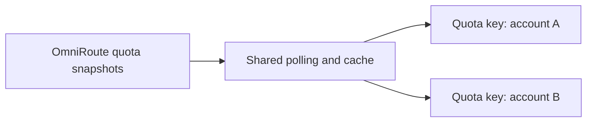

# OmniRoute Stream Deck Plugin

[Deutsch](README_de.md) · English

Display the remaining quotas of individual OmniRoute provider connections on Stream Deck keys. Assign one connection per **Quota** key, so two accounts of the same provider can have separate keys. The plugin reads quota snapshots from OmniRoute; it does not contact the providers directly.



One shared service polls OmniRoute for snapshots (approximately every 20 seconds) and supplies the cached data to each key according to its selected connection. Keys do not each start their own polling loop.

## Requirements

- A running, reachable OmniRoute instance and its API key.
- Stream Deck 7.1 or later on macOS 12+ or Windows 10+ (as declared by the [plugin manifest](omniroute/de.lars-brandt.omniroute.sdPlugin/manifest.json)).
- For building from source: Node.js and npm. The plugin manifest requests Node.js 24 for the Stream Deck runtime; use Node.js 24 for local development too.

## Build and activate locally

From the repository root:

```sh
cd omniroute
npm ci
npm run build
```

This builds `omniroute/de.lars-brandt.omniroute.sdPlugin/` and copies the production dependencies into that plugin folder. **Building does not install or activate the plugin.** With Stream Deck installed, link the built plugin locally using the Stream Deck CLI included in the development dependencies:

```sh
npx streamdeck link de.lars-brandt.omniroute.sdPlugin
```

Run the link command from `omniroute/`. It points Stream Deck at your local plugin folder; it is a development setup, not a downloadable release package. Open the Stream Deck app to use the linked plugin.

## Set up a Quota key

1. Drag a **Quota** action onto a Stream Deck key and open its Property Inspector.
2. Select **Connection settings**, enter the OmniRoute instance URL (for example, `http://localhost:20128`) and your OmniRoute API key, then choose **Save**. These settings are shared by all Quota keys. **Cancel** discards edits; saving does not test connectivity or validate the fields.
3. Under **Provider connection**, select the account you want this key to show. Use **Reload** to refresh the list. The selection is stored on this key, so other keys can select other connections, including accounts of the same provider.
4. Choose **Presentation**: **Text** (default) or **Double ring**. In the ring view, **Ring colors** offers predefined color schemes. Optionally set **Display name**; clearing it restores the provider name. These display choices are per key.

The text view labels up to two quota windows and shows their remaining amounts; the double-ring view uses outer and inner progress rings. Additional windows are indicated by a `+N` marker. Some quota values may be unknown (`?`) or unlimited (`∞`); neither is an invented percentage. A key with no selected connection asks for configuration instead of showing another account's data.

Keep your API key in the Stream Deck connection settings. Do not put it in repository files, screenshots, logs or issue reports. Plugin-wide Stream Deck settings hold the URL and key; individual Quota keys store their display choices and selected connection, not the API key.

## Troubleshooting

| Symptom | Check |
| --- | --- |
| Connection not configured / invalid settings | Open **Connection settings** on a Quota key and check the URL and API key. The URL should be a reachable HTTP(S) OmniRoute instance URL without embedded credentials, query or fragment. |
| Authentication failed | Check the API key in **Connection settings** (without sharing it). |
| OmniRoute unavailable or another request error | Check that OmniRoute is running and reachable from the Stream Deck computer; use **Reload** to retry the provider list. |
| Connection missing or no quota values | Check that the selected provider connection still exists in OmniRoute and has quota data; choose another connection if necessary. |
| Old values with a stale/error indicator | A previous snapshot is being shown after a failed refresh. Check connectivity; the marker clears after a successful refresh. |

## Development

Run from `omniroute/`:

```sh
npm test
npm run watch
```

`watch` rebuilds and restarts the linked plugin after changes. Keep it running while developing; changes to plugin code do not take effect until Stream Deck reloads the plugin. For debugging, use the Stream Deck Developer Tools. For implementation notes on logging, packaging and presentation, see [the plugin README](omniroute/README.md).
