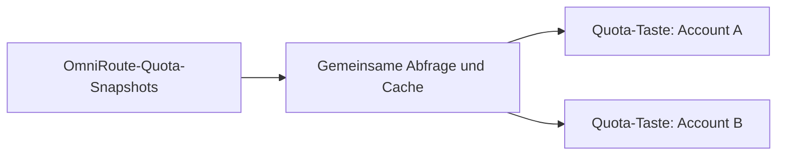

# OmniRoute Stream-Deck-Plugin

Deutsch · [English](README.md)

Zeigt die verbleibenden Quotas einzelner OmniRoute-Provider-Verbindungen auf Stream-Deck-Tasten an. Jeder **Quota**-Taste wird genau eine Verbindung zugeordnet. So können auch zwei Accounts desselben Providers getrennt angezeigt werden. Das Plugin liest Quota-Snapshots von OmniRoute und kontaktiert die Provider nicht direkt.



Ein gemeinsamer Dienst fragt OmniRoute regelmäßig nach Snapshots ab (ungefähr alle 20 Sekunden) und stellt jeder Taste die zwischengespeicherten Daten ihrer gewählten Verbindung bereit. Die Tasten starten keine eigenen Abfrageschleifen.

## Voraussetzungen

- Eine laufende, erreichbare OmniRoute-Instanz und deren API-Key.
- Stream Deck 7.1 oder neuer unter macOS 12+ oder Windows 10+ (laut [Plugin-Manifest](omniroute/de.lars-brandt.omniroute.sdPlugin/manifest.json)).
- Für den Build aus den Quellen: Node.js und npm. Das Manifest fordert Node.js 24 für die Stream-Deck-Laufzeit an; für die lokale Entwicklung ebenfalls Node.js 24 verwenden.

## Lokal bauen und aktivieren

Vom Repository-Wurzelverzeichnis aus:

```sh
cd omniroute
npm ci
npm run build
```

Dabei entsteht das Plugin unter `omniroute/de.lars-brandt.omniroute.sdPlugin/`; die Produktionsabhängigkeiten werden dorthin kopiert. **Der Build installiert oder aktiviert das Plugin nicht.** Bei installiertem Stream Deck kann die lokale Plugin-Version mit der in den Entwicklungsabhängigkeiten enthaltenen Stream-Deck-CLI verknüpft werden:

```sh
npx streamdeck link de.lars-brandt.omniroute.sdPlugin
```

Den Verknüpfungsbefehl im Verzeichnis `omniroute/` ausführen. Er verweist auf das lokale Plugin-Verzeichnis und richtet eine Entwicklungsumgebung ein, kein herunterladbares Release-Paket. Danach die Stream-Deck-App öffnen.

## Quota-Taste einrichten

1. Eine **Quota**-Action auf eine Stream-Deck-Taste ziehen und ihren Property Inspector öffnen.
2. **Connection settings** wählen, die URL der OmniRoute-Instanz (zum Beispiel `http://localhost:20128`) und den OmniRoute-API-Key eingeben und **Save** wählen. Diese Einstellungen gelten für alle Quota-Tasten. **Cancel** verwirft Änderungen; beim Speichern werden Verbindung und Eingaben nicht geprüft.
3. Unter **Provider connection** den Account für diese Taste auswählen. **Reload** lädt die Liste erneut. Die Auswahl wird pro Taste gespeichert; weitere Tasten können andere Verbindungen desselben Providers wählen.
4. Unter **Presentation** zwischen **Text** (Standard) und **Double ring** wählen. In der Ringansicht stehen unter **Ring colors** vordefinierte Farbschemata bereit. Ein eigener **Display name** ist optional; ein leeres Feld stellt den Providernamen wieder her. Diese Anzeigeoptionen gelten pro Taste.

Die Textansicht bezeichnet bis zu zwei Quota-Fenster und zeigt deren verbleibende Werte. Die Doppelring-Ansicht verwendet einen äußeren und einen inneren Fortschrittsring. Weitere Fenster werden mit `+N` angezeigt. Quota-Werte können unbekannt (`?`) oder unbegrenzt (`∞`) sein; dafür wird kein Prozentwert erfunden. Ohne ausgewählte Verbindung zeigt die Taste einen Konfigurationshinweis statt Daten eines anderen Accounts.

Den API-Key nur in den Stream-Deck-Verbindungseinstellungen eingeben, nicht in Repository-Dateien, Screenshots, Logs oder Fehlerberichte. Die pluginweiten Stream-Deck-Einstellungen enthalten URL und API-Key; einzelne Quota-Tasten speichern ihre Anzeigeoptionen und die gewählte Verbindung, nicht den API-Key.

## Fehlerbehebung

| Symptom | Prüfen |
| --- | --- |
| Verbindung nicht konfiguriert / ungültige Einstellungen | **Connection settings** einer Quota-Taste öffnen und URL sowie API-Key prüfen. Die URL sollte auf eine erreichbare OmniRoute-Instanz über HTTP(S) zeigen und keine eingebetteten Zugangsdaten, Query-Parameter oder Fragmente enthalten. |
| Authentifizierung fehlgeschlagen | API-Key unter **Connection settings** prüfen (nicht weitergeben). |
| OmniRoute nicht erreichbar oder anderer Abfragefehler | Prüfen, ob OmniRoute läuft und vom Stream-Deck-Rechner erreichbar ist; mit **Reload** die Providerliste erneut laden. |
| Verbindung fehlt oder keine Quota-Werte | Prüfen, ob die gewählte Provider-Verbindung in OmniRoute noch existiert und Quota-Daten hat; gegebenenfalls eine andere Verbindung wählen. |
| Alte Werte mit Veraltet-/Fehlerhinweis | Nach einer fehlgeschlagenen Aktualisierung wird der letzte Snapshot angezeigt. Verbindung prüfen; nach erfolgreicher Aktualisierung verschwindet der Hinweis. |

## Entwicklung

Im Verzeichnis `omniroute/` ausführen:

```sh
npm test
npm run watch
```

`watch` baut das verknüpfte Plugin nach Änderungen neu und startet es erneut. Während der Entwicklung laufen lassen: Änderungen am Plugin-Code werden erst nach dem Neuladen in Stream Deck wirksam. Zur Fehlersuche die Streamdeck Developer Tools nutzen. Hinweise zu Logging, Paketierung und Ansichten stehen in der [Plugin-README](omniroute/README.md).
